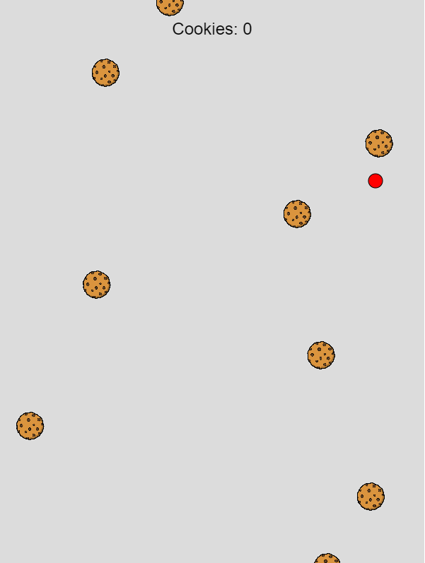

# Cookie clicker v2

This version of the cookie clicker comes with a node.js express server. This is so that the game can use assets; cookie images, in this case.



## Dependencies

You need to install node.js to run the server:

- [Node.js](https://nodejs.org/en)
- [pnpm](https://pnpm.io/) - This is optional, but recommended. This is a better version of npm.

Once you have node.js (and optionally pnpm), use ```npm i``` (or ```pnpm i```) to install the project dependencies.

## Running the server

To run the server, use the following command in this folder:

```
npm start
```

or

```
pnpm start
```

The project should run on a web page at http://localhost:5000.